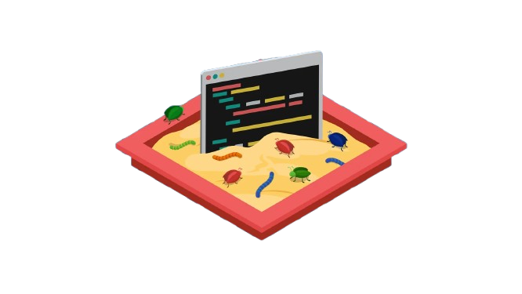

# Sandbox

Learning playground for small experiments, snippets, and quick prototypes.

## Structure
- `java/` — Java examples (streams, concurrency, etc.)
- `spring/` — Spring experiments

## Notes
Each folder may contain its own `README.md` with run steps and learnings.
